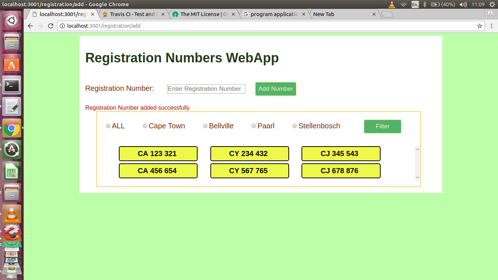

# Registration Numbers Webapp

## About the application
  This application allows a user to enter different car registration numbers for different towns and filters the registration numbers of the different towns entered by user, according to the town selected by the user. The application also has a validation which checks if town entered by the user is not already on the Mongo database and does not add the town, if a user has not entered any registration number.

## Different platforms the application can run on
  - Linux (Ubuntu)

## Get the Github Repository
#### Clone the Githhub Repository
  - On your terminal go to the directory where you want the application to be saved
  - On the terminal type git clone [link](https://github.com/siphokazi-codex/registration-routes-filter)

## Installations
### Different System Software needed for application
  - Install Atom Integrated Development Environment(IDE) on the terminal(type sudo apt-get install atom).
### Different Dependencies and devDependencies needed for application
  - On your terminal, go to the folder containing the application.
  - type npm install (to create node modules for the package.json file in the application).

## Tests

## Usage
### Output Example
  
    :tada: :registration:
### How to configure the app and run it on your machine
  - Open the project on your IDE, which is atom
  - Open the  terminal
  - Open the folder where the application is located on the terminal
  - Type nodemon on the terminal
  - Open the browser and type [link](http:/localhost:3001/registration/add).
### How the user can use the application
  - On the browser, enter the different car registration numbers for the different towns on the textbox provided, after that the user has t0he opportunity filter the for different towns as displayed on the application.  The user can than select the button for that particular town.

## Known Issues
  - The application can only run on Linux Ubuntu platform at the moment, platforms such as macOS, Windows are not yet covered for this application.

## License
[MIT](https://opensource.org/licenses/MIT)
